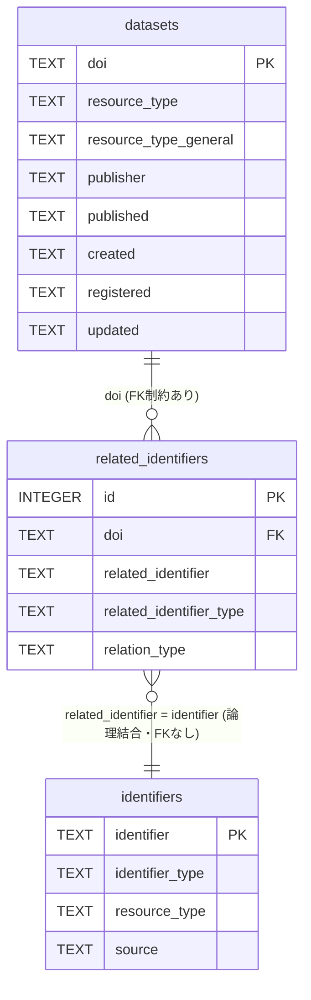

# DataCite APIによる研究データメタデータの取得とSQLiteへの保存手順

このリポジトリでは、DataCite APIを利用して研究データのメタデータを取得し、SQLiteデータベースに保存する手順をまとめています。

---

## 概要

本手順では以下の流れでデータを構築します：

1. DataCite APIから研究データのメタデータを取得
2. 関連識別子(relatedIdentifiers)を分離してSQLiteに格納
3. 外部APICrossref/DataCite）を用いて関連識別子のリソースタイプを取得
4. データと論文の関係を構造化する

## コード

* get_metadata.py
* get_resource_type.py

## 環境

- OS: Ubuntu (WSL)
- Python: 3.x
- 使用ライブラリ:
  - requests
  - sqlite3（標準ライブラリ）

---

## 1. SQLiteのインストール

```bash
sudo apt update
sudo apt install sqlite3
```
## 2. データベースの作成

```bash
sqlite3 metadata.db
```
## 3. テーブルの作成

### 3-1. メインテーブル

```sql
CREATE TABLE datasets (
    doi TEXT PRIMARY KEY,
    resource_type TEXT,
    resource_type_general TEXT, 
    publisher TEXT, 
    published TEXT,
    created TEXT,
    registered TEXT,
    updated TEXT
);
```

### 3-2. 関連識別子テーブル(子テーブル)

```sql
CREATE TABLE related_identifiers (
    id INTEGER PRIMARY KEY AUTOINCREMENT,
    doi TEXT,
    related_identifier TEXT,
    related_identifier_type TEXT,
    relation_type TEXT,
    FOREIGN KEY (doi) REFERENCES datasets(doi)
);
```

重複防止
```sql
CREATE UNIQUE INDEX uniq_rel
ON related_identifiers(doi, related_identifier, relation_type);
```

### 3-3. リソースタイプテーブル

```sql
CREATE TABLE identifiers (
    identifier TEXT PRIMARY KEY,
    identifier_type TEXT,
    resource_type TEXT,
    source TEXT
);
```

### 注意点

メインテーブル（datasets）と子テーブル（related_identifiers）は、データ間の対応関係（参照整合性）を保ち不正なデータ（存在しないDOI）を防ぐために外部キーで関連付けています。 
SQLiteの外部キー制約はデフォルトで無効のため、SQLite起動後に毎回以下を実行して外部キー制約を有効化する必要があります。
```sql
-- SQLite起動後すぐ実行
PRAGMA foreign_keys = ON;
```
Pythonで実行する場合: 
```python
conn.execute("PRAGMA foreign_keys = ON;")
```

## 4. 仮想環境の導入

```bash
python3 -m venv venv
source venv/bin/activate
```

## 5. 必要なライブラリのインストール

```bash
pip install requests
```

## 6. メタデータの取得

### 6-1. 設定

get_metadata.pyを開いて設定変更します。

```bash
contact_email = os.environ.get("CONTACT_EMAIL", "example@example.com")
```
* User-Agentにメールアドレスを含めることで利用者を識別可能にし、API提供者に配慮したアクセスを行います。
* 環境変数CONTACT_EMAILがあればそれを使います。

初期状態のフィルタリング設定は以下の通りです。必要に応じて変更してください。

* リソースタイプ: dataset
* 出版年: 2025
* 関連情報のrelation type属性: IsSupplementTo or IsReferencedBy
* 除外する出版者
    * HEPData
    * Cambridge Crystallographic Data Centre
    * National Institute for Fusion Science (NIFS)
    * UC San Diego Library Digital Collections

### 6-2. 実行

```bash
python get_metadata.py
```
取得したメタデータをmetadata.dbとraw_metadata.jsonに保存します。

### 6-3. 関連識別子のリソースタイプを取得

関連識別子（DOIやURL）に対して、Crossref / DataCite API から resource_type を取得し、identifiersテーブルに格納します。

```bash
python get_resource_type.py
```

### 補足: relationTypeの意味

- IsSupplementTo: データが論文の補足資料である
- IsReferencedBy: データが論文に引用されている
- IsPartOf / HasPart: データ同士の構成関係

---

## 7. データ確認手順

取得および保存したデータが正しく格納されているかを確認します。

---

### 7-1. テーブル一覧の確認

```sql
.tables
datasets             identifiers          related_identifiers
```

### 7-2. 各テーブルの件数確認

```sql
SELECT COUNT(*) FROM datasets;
SELECT COUNT(*) FROM related_identifiers;
SELECT COUNT(*) FROM identifiers;
9282
767
427
```

### 7-3. relation_typeの分布確認

```sql
SELECT relation_type, COUNT(*)
FROM related_identifiers
GROUP BY relation_type;
IsReferencedBy|94
IsSupplementTo|673
```
補足データが多く、データ引用は少ない。

### 7-4. resource_typeの分布確認

```sql
SELECT resource_type, COUNT(*)
FROM identifiers
GROUP BY resource_type
ORDER BY COUNT(*) DESC;
journal-article|315
|95
posted-content|8
|4
Article|2
book-chapter|1
Other|1
Numeric Data|1
```
論文への関連付けが多いが、データ(Numeric Data)への関連付けも1件ある

### 7-5. identifiersテーブルの解決率確認

```sql
SELECT COUNT(*)
FROM identifiers
WHERE resource_type IS NOT NULL;
332
```
```sql
SELECT COUNT(*)
FROM identifiers
WHERE resource_type IS NULL;
95
```
### 7-6. JOINによるデータ結合確認

```sql
SELECT d.doi,
       r.related_identifier,
       r.relation_type,
       i.resource_type
FROM related_identifiers r
JOIN datasets d ON r.doi = d.doi
LEFT JOIN identifiers i ON r.related_identifier = i.identifier
LIMIT 10;
10.13021/orc2020/lfph6m|10.21203/rs.3.rs-8195787/v1|IsSupplementTo|posted-content
10.14284/766|10.1021/acs.est.4c02223|IsReferencedBy|journal-article
10.14284/766|https://www.vliz.be/imis?refid=436470|IsReferencedBy|
10.14284/766|https://www.vliz.be/imis?refid=436471|IsReferencedBy|
10.15139/s3/0cjumx|10.1080/02699931.2020.1797638|IsSupplementTo|journal-article
10.15139/s3/mgxfuv|10.1080/02699931.2020.1797638|IsSupplementTo|journal-article
10.15139/s3/olg0tz|10.1080/02699931.2020.1797638|IsSupplementTo|journal-article
10.15139/s3/zaqsag|10.1080/02699931.2020.1797638|IsSupplementTo|journal-article
10.1594/pangaea.974302|10.5194/bg-22-7881-2025|IsSupplementTo|journal-article
10.1594/pangaea.983496|10.5194/os-22-403-2026|IsSupplementTo|journal-article
```

### 7-7. 未解決identifierの確認

```sql
SELECT *
FROM identifiers
WHERE resource_type IS NULL
LIMIT 10;
https://doi.org/10.31223/X5444J|arXiv||
https://github.com/ShMazumder/bddrugbank|URL||Unknown
/papers/w33944|URL||Unknown
https://wk-26.github.io/Civilization-Axioms-and-Immune-System-/|URL||Unknown
https://github.com/wk-26/Civilization-Axioms-and-Immune-System-|URL||Unknown
https://archive.org/details/a-new-civilization-for-humanity-cc-0|URL||Unknown
https://doi.org/10.21966/kace-2d24|DOI||
https://doi.org/10.21966/g7zf-1v08|DOI||
https://www.vliz.be/imis?refid=436470|URL||Unknown
https://www.vliz.be/imis?refid=436471|URL||Unknown
```

### 7-8. 重複データチェック

```sql
SELECT doi, related_identifier, relation_type, COUNT(*)
FROM related_identifiers
GROUP BY doi, related_identifier, relation_type
HAVING COUNT(*) > 1;
```
重複なし

### 7-9. データ→論文関係の確認

```sql
SELECT d.doi,
       i.resource_type,
       r.related_identifier
FROM datasets d
JOIN related_identifiers r ON d.doi = r.doi
JOIN identifiers i ON r.related_identifier = i.identifier
WHERE i.resource_type = 'journal-article'
LIMIT 10;
10.14284/766|journal-article|10.1021/acs.est.4c02223
10.15139/s3/0cjumx|journal-article|10.1080/02699931.2020.1797638
10.15139/s3/mgxfuv|journal-article|10.1080/02699931.2020.1797638
10.15139/s3/olg0tz|journal-article|10.1080/02699931.2020.1797638
10.15139/s3/zaqsag|journal-article|10.1080/02699931.2020.1797638
10.1594/pangaea.974302|journal-article|10.5194/bg-22-7881-2025
10.1594/pangaea.983496|journal-article|10.5194/os-22-403-2026
10.1594/pangaea.986587|journal-article|10.1002/aqc.3418
10.1594/pangaea.987124|journal-article|10.1007/s10533-025-01283-y
10.16904/envidat.693|journal-article|10.1111/1365-2664.70439
```

### 7-10. データ→データ関係の確認

```sql
SELECT d.doi,
       i.resource_type,
       r.related_identifier
FROM datasets d
JOIN related_identifiers r ON d.doi = r.doi
JOIN identifiers i ON r.related_identifier = i.identifier
WHERE i.resource_type != 'journal-article'
LIMIT 10;
10.13021/orc2020/lfph6m|posted-content|10.21203/rs.3.rs-8195787/v1
10.1594/pangaea.986031|posted-content|10.5194/egusphere-2025-2774
10.18710/gshjeb|posted-content|10.1101/2025.07.30.667361
10.18738/t8/hdotfv|posted-content|10.1101/2025.11.25.690444
10.18738/t8/r9mscp|Article|10.48550/arxiv.2507.01228
10.25375/uct.28016702.v1|posted-content|10.1101/2025.10.15.682533
10.25375/uct.28263767.v1|posted-content|10.1101/2025.06.26.661885
10.5281/zenodo.14675466|posted-content|10.1101/2024.10.01.612096
10.5281/zenodo.14675467|posted-content|10.1101/2024.10.01.612096
10.5281/zenodo.15353159|Numeric Data|10.5439/2530546
```

---


## 8. 確認ポイント

* datasetsテーブルに重複DOIがないこと
* related_identifiersに重複がないこと（UNIQUE制約）
* identifiersテーブルが適切に補完されていること
* relation_typeごとの件数が取得対象と一致していること
* JOINが正常に機能していること

## 9. 期待される結果

* relation_type に "IsSupplementTo" および "IsReferencedBy" が含まれる
* 多くのrelated_identifierが journal-article として分類される
* 一部に dataset（Numeric Data等）も含まれる

## テーブル構造



